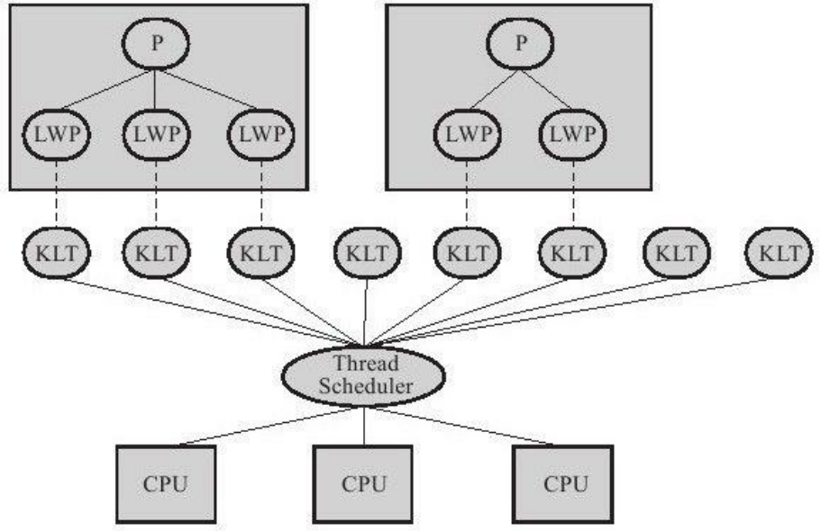
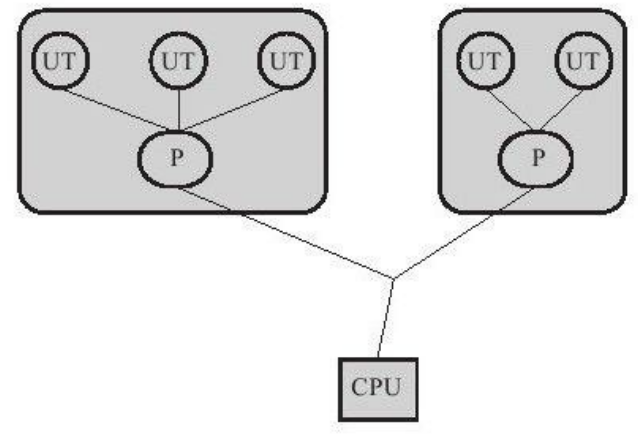
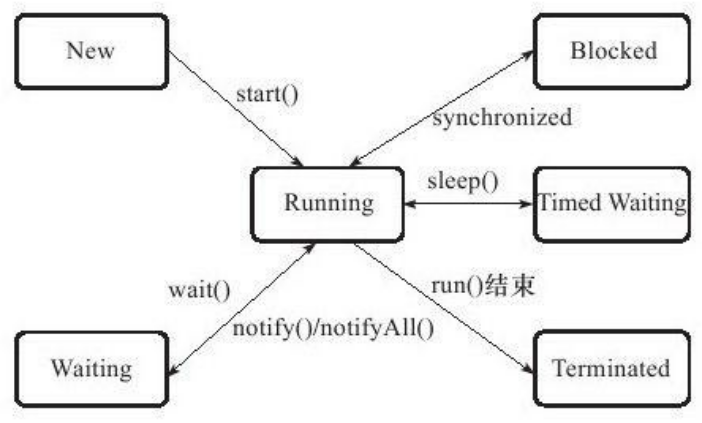

> java的jvm虚拟机将线程技术发扬光大了

### 线程的实现方式

实现线程主要有3种方式:使用内核线程实现、使用用户线程实现和使用用户线程加轻量级进程混合实现。

------------

内核线程(Kernel-Level Thread,KLT)就是直接由操作系统内核(Kernel,下称内核)支持的线程,这种线程由内核来完成线程切换,内核通过操纵调度器(Scheduler)对线程进行调度,并负责将线程的任务映射到各个处理器上。

> 程序一般不会直接去使用内核线程,而是去使用内核线程的一种高级接口——轻量级进程(Light Weight Process,LWP),轻量级进程就是我们通常意义上所讲的线程,由于每个轻量级进程都由一个内核线程支持,因此只有先支持内核线程,才能有轻量级进程，对应关系如下：（p:用户，LWP：轻量级线程，KLT：内核线程，Thread Scheduer：线程池）



> 使用内核线程模式的局限性：基于内核线程实现的,所以各种线程操作,如创建、析构及同步,都需要进行系统调用。而系统调用的代价相对较高,需要在用户态(User Mode)和内核态(KernelMode)中来回切换。其次,每个轻量级进程都需要有一个内核线程的支持,因此轻量级进程要消耗一定的内核资源(如内核线程的栈空间),因此一个系统支持轻量级进程的数量是有限

#### 使用用户线程实现

通俗来说就是使用建立在用户空间的线程库，而不是使用系统内部的内核机制   



使用用户线程的优势在于不需要系统内核支援,劣势也在于没有系统内核的支援,所有的线程操作都需要用户程序自己处理。线程的创建、切换和调度都是需要考虑的问题,而且由于操作系统只把处理器资源分配到进程,那诸如“阻塞如何处理”、“多处理器系统中如何将线程映射到其他处理器上”这类问题解决起来将会异常困难,甚至不可能完成。

#### 使用用户线程加轻量级进程混合实现

在这种混合实现下，用户线程的创建、切换、析构等操作依然廉价,并且可以支持大规模的用户线程并发，操作系统提供支持的轻量级进程则作为用户线程和内核线程之间的桥梁,这样可以使用内核提供的线程调度功能及处理器映射,并且用户线程的系统调用要通过轻量级线程来完成,大大降低了整个进程被完全阻塞的风险


对于Sun JDK来说,它的Windows版与Linux版都是使用一对一的线程模型实现的,一条Java线程就映射到一条轻量级进程之中,因为Windows和Linux系统提供的线程模型就是一对一的 。

### java 多线程提供的相关知识

java内部线程状态的切换模式



#### 创建线程的方法

#### 继承 Thread类或者实现Runnable借口

```java
class CreateThread extends Thread{
	@Override
	public void run() {
		System.out.println("create Thread by thread Class");
	}
}
class CreateThread2 implements Runnable{
	@Override
	public void run() {
		// TODO Auto-generated method stub
		System.out.println("create Thread by interface");
	}
}
```

#### java线程的一些操作方法

```java
Thread thread = new Thread(runnable, "one");// 最后一个参数是线程名称
Thread teThread = new Thread(Thread.currentThread().getThreadGroup(), runnable, "123");// 第一个参数传入的线程名称
thread.join(100);// 线程联合 当线程使用 join 将会暂停手上的线程转而去执行
		// join线程的方法 当join中线程的方法实现完成后将会自动执行原来主线程中的方法
		// 内部实现wait方法会释放锁
thread.join();// 等待要加入的线程执行完再执行 ---join 内部实现wait方法 会释放锁 作用等待线程对象销毁(sleep 方法将会到之相关的县城被占用)
	     //当前的线程等待thread线程
thread.isAlive();// 判断线程是否终止 true 没有终止
thread.run();// 线程的入口点
thread.start();// 调用线程润方法启动 默认调用thread 中的run 方法
thread.sleep(100);// 线程进行休眠
thread.getPriority();// 返回线程的优先级
thread.setPriority(8);// 设置线程的抢占优先级
thread.getState();//获得指定线程的状态
		//new-创建 runnable-运行 terminated-销毁 TiMED_WAITING-（sleep等待状态) blocked-（等待锁状态） waiting-（使用wait之后的状态）
		// 使用同一个类的不同线程间的通信---同一类中的不同方法在同一个类中被调用
		// !!!!!!!!!wait 方法 必须和 synchxxx关键字一起使用否则会抛出
		// 异常java.lang.IllegalMonitorStateException
		// 精确的解释 休眠正在调用的当前线程 唤醒一个调用过这个的当前线程
		// 注意有this运算符的时候其实是对当前类进行操作作用于调用这个类的线程
this.wait();// ---将调用当前类的线程进行休眠--应当在循环中使用这个方法因为需要循环检测 <span> </span>// 指的是调用这个方法的一个线程进行休眠而其他的不惊醒休眠 <span> </span>this.wait(10000);// 将调用当前类的线程只进行休眠1s
this.notify();// ---唤醒当前的类被wait的一个线程(调用方法的对象不会停止)
		// 是的是当前调用对象的所有线程中 唤醒其中的一个
this.notifyAll();// --唤醒当前的类被wait的所有线程---注意是占用的类
thread.yield();// ---放弃当前资源让其他任务去占用cpu时间并不是结束当前的运行
thread.interrupt();// 终止sleep--改变线程状态 wait的对象会抛出 异常----改变Thread.isTnterrupted();的状态
Thread.interrupted();//静态方法 会制标识位为false 测试线程是否停止 --使用后将会改变状态 ---这个方法只有一个使用的方法就是使用sleep+interupted抛出异常
thread.isInterrupted();// 测试线程是否终止使用后 不会改变标识位 讲不会改变状态-判断是否使用了interrupted
		//interrupted 是作用于当前线程，isInterrupted 是作用于调用该方法的线程对象所对应的线程。（线程对象对应的线程不一定是当前运行的线程。例如我们可以在A线程中去调用B线程对象的isInterrupted方法。）
		//当一个线程处于中断状态时，如果再由wait、sleep以及jion三个方法引起的阻塞，那么JVM会将线程的中断标志重新设置为false，并抛出一个InterruptedException异常，然后开发人员可以中断状态位“的本质作用-----就是程序员根据try-catch功能块捕捉jvm抛出的InterruptedException异常来做各种处理，比如如何退出线程。
		//地门
thread.setDaemon(true);// 将会变成一个守护线程 守护线程将会在外部的线程结束时候自动的结束
		// 线程结束的方法 推荐使用 return 结束这个函数的run方法就可以了 使用stop可能会发生不可预料的结果
		// 过时方法 不推荐使用了---但是这个个方法只是使用暂停但是没有释放暂停的方法
thread.suspend();
thread.resume();
		//线程组--几乎没什么用就是就是个线程的简单包装
thread.activeCount();
ThreadGroup threadGroup = new ThreadGroup("sdf");
threadGroup.activeGroupCount();//返回线组中的活动线程组的数量
thread.activeCount();//	返回线程中相同线程组中的线程数量;
threadGroup.activeCount();//返回这个线程组中的相同线程的数量
		//Thread 表示使用的当前的线程
		//如果线程是通过实现Runnable接口来实现的，则不是Thread类，不能直接使用Thread.xxxxx，
Thread.currentThread();// 获得当前正在使用的cpu线程	
Thread.activeCount();
Thread.interrupted();
Thread.holdsLock(new String());//如果當前線程在指定的對象上保持監視器鎖此方法返回true。
Thread.yield();
Thread.interrupted();
```

#### java基础锁机制

```java
// 当 多线程的时候如果出现了异常 锁会自动的释放
// 同步锁只只是对加了同步的部分进行的同步
class Ceshi5 {
	// 函数定义了这个关键字表示 同步方法 将会使用互斥锁 争夺类的资源互斥--!!!!!!但是要保证同的线程使用的是相同的类引用
	// 当函数被分装好没办法进行操作的时候 可以使用 同步代码块进行处理
	// synchronized 只能修饰 方法 而且方法不具有继承性 也就是说如果子类重写了这个方法 并且没有在动态的加上
	// synchronized的时候将会 重写的方法将不会有继承性
	// 这个方法 会导致线程中所有的 同步方法 和同步代码块都不进行相互冲突
	//wo le ti e
	volatile int a;// 声明变量的值是从共有堆()中 取得的数据 而不是 从私用堆中 jvm在server模式下  为实现效率没有同步共有私有堆的数据--死记着
	//thing kui nai zi di
	synchronized public void call(String s) {
		// 这个方法加上的是对象同步锁(就是使用不同的线程调用相同的对象) 对于不同的对象 他们之间的synchronized 是没有区别的
		System.out.print("{" + s);
		try {
			Thread.sleep(1000);
		} catch (InterruptedException e) {
			e.printStackTrace();
		}
		System.out.println("}");
		call2();// 锁重入 --可以调用方法中其他 加上 synchronized 的方法
		//锁重入可以同步synchronized方法或者synchronized(this){}代码块 或者 相同对象的synchronized(xx){}代码块
	}
	synchronized public static void call3(int a) {
	}// 当给静态类加上 同步方法的时候 将会给整个类加上加持 加上的不是对象锁而是class类锁 因为静态方法 全局位以可以通过类名直接使用
	// 因为使用的锁是不同的 所以 静态同步的对象同步将会表现位异步
	// 锁重入 --- 在加锁的方法中可以调用方法内部其他线程没有调用的加synchronized的方法
	// 锁重入也可以发生在父元素的方法中
	synchronized public void call2() {
		//其实这个的实现是默认使用当前的
	}
	public void call3() {
		// 同步代码块 参数串入需要进行调用的引用- 从而保证锁调用的对象!!是被同步的
		synchronized (this) {
		} // 同步代码块中的参数是指定到底是将哪个类作为监视对象---同步哪个实现类中的对象
		// 此函数中除了同步代码块之外的所有方法都是并行的 代码块中的是同步的---所以 当发生竞争的时候代码将会先运行其他的东西然后在运行此方法
		// 当一个同步代码块被运行的时候 此函数中其他同步代码块将会被阻塞
		synchronized (new Object()) {
		}
		// 当同步代码块中的类是可以跨引用的 也就是说不同的类实例使用使用同步代码块中的一个属性将会保持同步
	}
```

#### 使用atomic工具实现数据共享

```java
//实现多个线程 之间 访问公共变量的方法
//记住要保证 多线程的问题 需要考虑到每一步的原子性问题
class Mythread extends Thread {
	// 这个只是解决了共享内存的问题
	volatile public static int count = 0;// static 加上 volatile 实现同步变量 实现变量的可见性
	//jvm虚拟机如果运行在 服务器模式下 虚拟机将会 通过工作内存进行随便的拿来不管有没有别人正在使用改变数值
	//volatile将会强制使用最新的变量--相当于给变量加上互斥锁
	//这个解决了重复赋值的问题
	//原子性加可见性
	//我 了 太 e
	volatile AtomicInteger aaAtomicInteger = new AtomicInteger(10);// 声明原子性的变量可以实现原子性
	synchronized public static void add() { // static 加上 synchronized 实现 class
											// 类级别的同步变量
		for (int i = 0; i < 100; i++) {
			count++;
		}
		System.out.println("count=" + count);
	}
	@Override
	public void run() {
		super.run();
		add();
	}
	//使用线程组
	public static void main2(String[] args) {
		System.out.println("A处线程：" + Thread.currentThread().getName() + ", 所属线程："
				+ Thread.currentThread().getThreadGroup().getName() + ", 组中有线程组数量："
				+ Thread.currentThread().getThreadGroup().activeGroupCount());
		ThreadGroup group = new ThreadGroup("新的组");
		System.out.println("B处线程：" + Thread.currentThread().getName() + ", 所属线程："
				+ Thread.currentThread().getThreadGroup().getName() + ", 组中有线程组数量："
				+ Thread.currentThread().getThreadGroup().activeGroupCount());
		ThreadGroup[] tg = new ThreadGroup[Thread.currentThread().getThreadGroup().activeGroupCount()];
		Thread.currentThread().getThreadGroup().enumerate(tg);
		for (int i = 0; i < tg.length; i++)
			System.out.println("第一个线程组名称为：" + tg[i].getName());
	}
}
```

