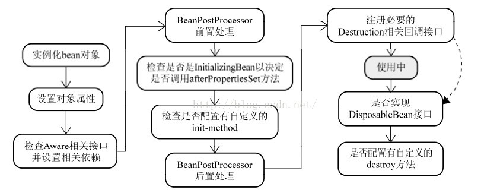
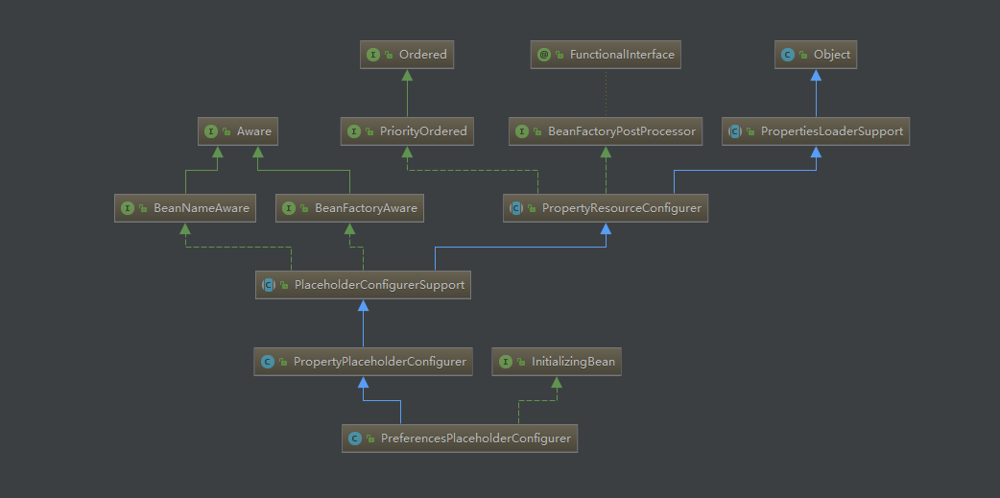

### spring javabean的生命周期\容器扩展\lookup方法\spring事件



- 使用配置文件的方法

> 注意 <beans>标签中可以配置全局使用的初始化方法和销毁方法

```xml
<?xml version="1.0" encoding="UTF-8"?>
<beans xmlns="http://www.springframework.org/schema/beans"
	xmlns:xsi="http://www.w3.org/2001/XMLSchema-instance"
	xsi:schemaLocation="http://www.springframework.org/schema/beans http://www.springframework.org/schema/beans/spring-beans.xsd"
	default-init-method="" default-destroy-method="">
	<bean id="mybean" class="h_Bean的生命周期.MyBean" init-method="init"
		destroy-method="Mydestroy">  <!-- 使用init-method 的 destroy—method 方法指定生命周期的指定和完成方法 -->
	</bean>
</beans>
```

- 使用注解和接口相关的配置方法

```java
import org.springframework.beans.factory.DisposableBean;
import org.springframework.beans.factory.InitializingBean;
//使用bean的生命周期配置 - 注意bean的生命周期只是针对单例模式下的bean对象因为对于非单例模式 spring框架只进行创建而不管其他的用途
//所以spring框架对非单利模式不进行生命周期的检测
//InitializingBean接口表示bean对象在全部的依赖关系都被设置之后将会被自动的进行调用
public class MyBean implements InitializingBean,DisposableBean{
	//接口中定义的初始化方法
	public void afterPropertiesSet() throws Exception {}
	//接口中定义的销毁方法
	public void destroy() throws Exception {}
	//配置文件中定义的初始化方法
	public void init(){}
	//配置文件中定义的销毁方法
	public void Mydestroy(){}
	//这些方法的调用顺序是先调用接口的方法再掉用配置文件中的方法
}
```

> 注意：接口的执行优先级无论是初始化或者销毁都比配置文件放有限执行, SmartInitializingSingleton 所有非lazy单例Bean实例化完成后的回调方法

```java
public class MySmartInitializingSingleton implements SmartInitializingSingleton {
    //所有非lazy单例Bean实例化完成后，会调用该方法
    @Override
    public void afterSingletonsInstantiated() {
        System.out.println("单例Bean实例化完成了");
    }
}
```

spring 中bean的生命周期的配置除了使用 xml 指定 的方法之外还能使用注解的方法进行相关的配置

```java
@PostConstruct
public void methodinit(){}
@PreDestroy
public void methoddestry(){};
```

同时spring还提供了让bean和容器进行相关关联bean 方法

```java
public interface Lifecycle {
  void start();
  void stop();
  boolean isRunning();
}

public interface LifecycleProcessor extends Lifecycle {
  void onRefresh();
  void onClose();
}

public interface Phased {
  int getPhase();
}

public interface SmartLifecycle extends Lifecycle, Phased {
  boolean isAutoStartup();
  void stop(Runnable callback);
}

```

所有的bean都可以实现这些接口，然后在容器进行增加或者删除的时候将会自动的执行相关的方法，注意SmartLifecycle 接口中的stop方法将会传入一个实现runnabe接口的类，容器在进行销毁之后将会自动的异步执行这个类中的相关的run方法，Phased的getphase将会设置一个等级，用来表示优先级

**引申 ：spring容器可以使用ctx.registerShutdownHook(); 方法实现优雅停机操作**

#### spring 后置处理器 (容器扩展方法)

1. BeanPostProcessors接口

如果这个接口的某个实现类被注册到某个容器，那么该容器的每个受管Bean在调用初始化方法之前，都会获得该接口实现类的一个回调。容器调用接口定义的方法时会将该受管**Bean的实例和名字通过参数传入方法**，进过处理后通过方法的返回值返回给容器。

要使用BeanPostProcessor回调，就必须先在容器中注册实现该接口的类，BeanFactory和ApplicationContext容器的注册方式不大一样：

- 若使用BeanFactory，则必须要显示的调用其addBeanPostProcessor()方法进行注册，参数为BeanPostProcessor实现类的实例.
- 如果是使用ApplicationContext，那么容器会在配置文件在中自动寻找实现了BeanPostProcessor接口的Bean，然后自动注册，我们要做的只是配置一个BeanPostProcessor实现类的Bean就可以了。

假如我们使用了多个的BeanPostProcessor的实现类，只要实现Ordered接口，设置order属性就可以确定不同实现类的处理顺序了。

```java
import org.springframework.beans.BeansException;
import org.springframework.beans.factory.config.BeanPostProcessor;
public class JavaBeanPostProcessor implements BeanPostProcessor{
    public Object postProcessBeforeInitialization(Object bean, String beanName) throws BeansException {
        System.out.println("BeanPostProcessor:before"+beanName);
        return bean;
    }

    public Object postProcessAfterInitialization(Object bean, String beanName) throws BeansException {
        System.out.println("BeanPostProcessor:after"+beanName);
        return bean;
    }
}
```

注意其中的after和before的方法,这两个方法将会在声明周期的初始化之前和初始化之后进行调用,传入的bean 就是 需要使用的Bean 传入的beanName就是配置的beanname , 一般就是对指定的相关的bean进行处理


2. BeanFactoryPostProcessor接口

BeanFactoryPostProcessor接口实现类可以在当前BeanFactory初始化后，bean实例化之前对BeanFactory做一些处理。BeanFactoryPostProcessor是针对于bean容器的，在调用它时，BeanFactory只加载了bean的定义，还没有对它们进行实例化，所以我们可以通过对BeanFactory的处理来达到影响之后实例化bean的效果。跟BeanPostProcessor一样，ApplicationContext也能自动检测和调用容器中的BeanFactoryPostProcessor。
接口的信息如下:

```java
package com.meituan.hyt.test1;
import org.springframework.beans.BeansException;
import org.springframework.beans.factory.config.BeanFactoryPostProcessor;
import org.springframework.beans.factory.config.ConfigurableListableBeanFactory;
public class UserBeanFactoryPostProcessor implements BeanFactoryPostProcessor {
    @Override
    public void postProcessBeanFactory(ConfigurableListableBeanFactory configurableListableBeanFactory) throws BeansException {
        System.out.println("BeanFactoryPostProcessor doing");
    }
}
```

在spring中有一些特殊的操作就是使用BeanFactoryPostProcessor接口，比如类名替换PropertyPlaceholderConfigurer。他可以自动将相关的java properties信息替换成需要的,这里分析一下这个类:



接口:InitializingBean  --- 只有一个方法afterPropertiesSet 当bean实例化之后将会调用这个方法,我们可以在这里初始化一下属性
接口:order 可以指定优先级
接口:BeanNameAware和BeanFactory 配置配置回调将容器的和配置的相关参数传入
类: PropertiesLoaderSupport,PropertyResourceConfigurer  将配置文件中的参数进行绑定,提供配置文件解析功能
类:PlaceholderConfigurerSupport 真正的实现插入方法,这个类最核心的方法:

```java
	//遍历给定的BeanDefinition对象和它们中包含的MutablePropertyValues和ConstructorArgumentValues。
	public void visitBeanDefinition(BeanDefinition beanDefinition) {
		visitParentName(beanDefinition);
		visitBeanClassName(beanDefinition);
		visitFactoryBeanName(beanDefinition);
		visitFactoryMethodName(beanDefinition);
		visitScope(beanDefinition);
		if (beanDefinition.hasPropertyValues()) {
			visitPropertyValues(beanDefinition.getPropertyValues());
		}
		if (beanDefinition.hasConstructorArgumentValues()) {
			ConstructorArgumentValues cas = beanDefinition.getConstructorArgumentValues();
			visitIndexedArgumentValues(cas.getIndexedArgumentValues());
			visitGenericArgumentValues(cas.getGenericArgumentValues());
		}
	}
```

遍历给定的BeanDefinition对象和它们中包含的MutablePropertyValues和ConstructorArgumentValues。


```java
<bean class="org.springframework.beans.factory.config.PropertyPlaceholderConfigurer">
    <property name="locations" value="classpath:com/foo/jdbc.properties"/>
</bean>
<bean id="dataSource" destroy-method="close"
        class="org.apache.commons.dbcp.BasicDataSource">
    <property name="driverClassName" value="${jdbc.driverClassName}"/>
    <property name="url" value="${jdbc.url}"/>
    <property name="username" value="${jdbc.username}"/>
    <property name="password" value="${jdbc.password}"/>
</bean>
```

注意其中有BeanFactoryPostProcessor的使用方法

```java
public class MyBeanFactoryPostProcessor implements BeanFactoryPostProcessor {
   public void postProcessBeanFactory(ConfigurableListableBeanFactory beanFactory) throws BeansException {
      System.out.println("调用MyBeanFactoryPostProcessor的postProcessBeanFactory");
      BeanDefinition bd = beanFactory.getBeanDefinition("myJavaBean");
      MutablePropertyValues pv =  bd.getPropertyValues();
      if (pv.contains("remark")) {
          pv.addPropertyValue("remark", "在BeanFactoryPostProcessor中修改之后的备忘信息");
      }
  }
}
```
其中的postProcessBeanFactory这个方法中的参数是决定BeanFactoryPostProcessor强于BeanPostProcessor的关键之处,其中有一个参数:**ConfigurableListableBeanFactory**,这个参数可以进行配置相关的配置首先具体见下

这个接口只有一个实现类:DefaultListableBeanFactory

看一下关系继承图


重点关注这个接口:ConfigurableListableBeanFactory,这个接口继承了ListableBeanFactory, AutowireCapableBeanFactory, ConfigurableBeanFactory 这三个接口 

0. BeanFactory 主要提供getbean ,和isSingleType 这样的方法
1. ListableBeanFactory 这个接口是BeanFactory接口的实现之一(还有HierarchicalBeanFactory,AutowireCapableBeanFactory),这个主要是获取容器中各种相关javabean属性的方法,比如有 getBeansOfType,getBeansWithAnnotation 这种方法,
2. AutowireCapableBeanFactory 提供自动装配扩展(用来分层将功能细化)
3. HierarchicalBeanFactory 其中有一个方法,getParentBeanFactory 这里提供分级功能,实现了这个接口可以获取夫工厂方法
4. 


### 单例模式下实现内部变量非单例配置

> 之前在博客中做过测试，在spring容器中单例模式注入非单例模式属性的时候其实各个元素注入的是相同的类（使用工厂方法进行注入的时候也是如此）（==返回true），想要获取不同的属性就要使用lookup标签

#### 配置文件

> spring框架在抽象类中将会自动使用动态代理实现这个抽象方法，讲指定的bean对象进行返回如果对象实现了借口  spring框架将会使用jdk代理 否则使用cglib代理  推荐使用接口

```xml
<?xml version="1.0" encoding="UTF-8"?>
<beans xmlns="http://www.springframework.org/schema/beans"
	xmlns:xsi="http://www.w3.org/2001/XMLSchema-instance"
	xsi:schemaLocation="http://www.springframework.org/schema/beans http://www.springframework.org/schema/beans/spring-beans.xsd">
	<bean id="beanone" class="BeanOne" scope="prototype">
		<property name="name" value="beanone2"></property>
		<property name="age" value="1234"></property>
	</bean>
	<bean id="lookupclass" class="LookupClass">
		<lookup-method name="getBeanOne" bean="beanone"></lookup-method>
	</bean>
</beans>
```

#### Lookup类

```java
public abstract class LookupClass {
	abstract public BeanOne getBeanOne();
}
```

#### javabean

```java
public class BeanOne {
	private String name;
	private int age;
	private BeanTwo beanTwo;
	public String getName() {
		return name;
	}
	public void setName(String name) {
		this.name = name;
	}
	public int getAge() {
		return age;
	}
	public void setAge(int age) {
		this.age = age;
	}
	public BeanTwo getBeanTwo() {
		return beanTwo;
	}
	public void setBeanTwo(BeanTwo beanTwo) {
		this.beanTwo = beanTwo;
	}
	
}
```

### spring监听器

> 其实就是实现一个event 和 一个listener的过程

#### event 一个事件

event 事件并不需要在配置文件中进行配置，是需要使用application手动发出   实现 ApplicationEvent接口

```java

import org.springframework.context.ApplicationEvent;
//实现spring相应首先要进行spring event事件的注册
//这个方法只是一个封装器-用来将事件进行封装通过接口传递到 实现类中 然后在发出事件
public class MyApplicationEvent extends ApplicationEvent{
	private static final long serialVersionUID = 1L;
	Object object =null;
	//注意这里的第一个参数其实没有什么用就是为了个事件一个参数进行生成一个标号 传递过来的source将会在使用后变成空值
	public MyApplicationEvent(Object source,String string) {
		super(source);
		// TODO Auto-generated constructor stub
		this.object=string;
		System.out.println(object.toString());
	}
	public void say(){
		if(this.object!=null){
			System.out.println(object.toString());
		}
		else{
			System.out.println("this object is Null!!");
		}
	}
}
```

#### spring发送event

ApplicationListener   这个监听器需要在bean中进行配置，spring容器会自动的处理event

```java
import org.springframework.context.ApplicationEvent;
import org.springframework.context.ApplicationListener;
import org.springframework.context.event.ContextClosedEvent;
import org.springframework.context.event.ContextRefreshedEvent;
import org.springframework.context.event.ContextStartedEvent;
import org.springframework.context.event.ContextStoppedEvent;
 
import c_spring_applicationContext的事件机制.applicationEvent.MyApplicationEvent;
 
public class MyApplicationListener implements ApplicationListener<ApplicationEvent>{
	@Override
	public void onApplicationEvent(ApplicationEvent arg0) {
		if (arg0 instanceof MyApplicationEvent){
			((MyApplicationEvent) arg0).say();
		}
		//指的是xml文件加载完成并且可用后发出的事件
		if (arg0 instanceof ContextRefreshedEvent){
			((MyApplicationEvent) arg0).say();
		}
		//当ConfigurableApplicationContext 接口的start（）方法的时候触发这个方法 
		if (arg0 instanceof ContextStartedEvent){
			((MyApplicationEvent) arg0).say();
		}
		//当ConfigurableApplicationContext 接口的close（）方法的时候触发这个方法 
		if (arg0 instanceof ContextClosedEvent){
			((MyApplicationEvent) arg0).say();
		}
		//当ConfigurableApplicationContext 接口的stop（）方法的时候触发这个方法 
		if (arg0 instanceof ContextStoppedEvent){
			((MyApplicationEvent) arg0).say();
		}
		//requestHandledEvent web相关的事件 只能使用 dispatcherServlet的web应用当中 当用户请求结束的时候将会自动触发
	}
}
```

#### xml配置文件

```xml
<?xml version="1.0" encoding="UTF-8"?>
<beans xmlns="http://www.springframework.org/schema/beans"
	xmlns:xsi="http://www.w3.org/2001/XMLSchema-instance"
	xsi:schemaLocation="http://www.springframework.org/schema/beans http://www.springframework.org/schema/beans/spring-beans.xsd">
	<bean id="myapplicationListener" class="c_spring_applicationContext的事件机制.applicationEventListener.MyApplicationListener">
		<!-- 当时用监听方法的时候必须必须将监听listener注册到bean容器内这样spring框架才能自动进行调用 -->
		<!-- event事件spring设计的时候就没有将他设计为能加入进bean容器的方法因为没有空的构造函数 -->
	</bean>
	<!-- 注册了监听器将会自动的进行监听相关的各种event -->
</beans>
```

### spring bean获得容器和自身相关属性

spring 中bean获得spring 需要实现一下两个接口

- ApplicationContextAware
- BeanFactoryAware

```java
import org.springframework.beans.BeansException;
import org.springframework.beans.factory.BeanFactory;
import org.springframework.beans.factory.BeanFactoryAware;
import org.springframework.context.ApplicationContext;
import org.springframework.context.ApplicationContextAware;
public class TestBean implements ApplicationContextAware,BeanFactoryAware{
	@Override
	public void setBeanFactory(BeanFactory beanFactory) throws BeansException {
		// TODO Auto-generated method stub
		//传入的参数就是需要进行使用的容器
	}
	@Override
	public void setApplicationContext(ApplicationContext applicationContext) throws BeansException {
		// TODO Auto-generated method stub
		//传入的参数就是需要进行使用的容器
	}
}
```

spring bean获得自身的相关配置属性使用如下的接口

- BeanClassLoaderAware
- BeanNameAware

```java
import org.springframework.beans.factory.BeanClassLoaderAware;
import org.springframework.beans.factory.BeanNameAware;
public class TestBean implements BeanNameAware,BeanClassLoaderAware{
	@Override
	public void setBeanClassLoader(ClassLoader classLoader) {
		// TODO Auto-generated method stub
		
	}
	@Override
	public void setBeanName(String name) {
		// TODO Auto-generated method stub
		
	}
	
}
```