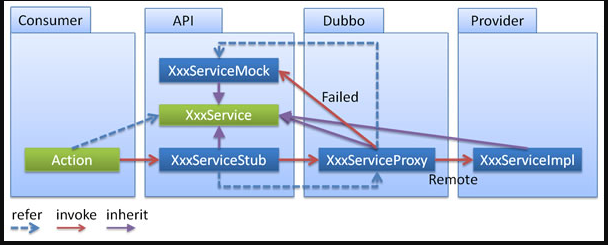

## 参数回调
> 参数回调方式与调用本地 callback 或 listener 相同，只需要在 Spring 的配置文件中声明哪个参数是 callback 类型即可。Dubbo 将基于长连接生成反向代理，这样就可以从服务器端调用客户端逻辑。

> 服务接口示例

```java
CallbackService.java
package com.callback;
 
public interface CallbackService {
    void addListener(String key, CallbackListener listener);
}
CallbackListener.java
package com.callback;
 
public interface CallbackListener {
    void changed(String msg);
}


> 服务提供者接口实现示例

```java
package com.callback.impl;
 
import java.text.SimpleDateFormat;
import java.util.Date;
import java.util.Map;
import java.util.concurrent.ConcurrentHashMap;
 
import com.callback.CallbackListener;
import com.callback.CallbackService;
 
public class CallbackServiceImpl implements CallbackService {
     
    private final Map<String, CallbackListener> listeners = new ConcurrentHashMap<String, CallbackListener>();
  
    public CallbackServiceImpl() {
        Thread t = new Thread(new Runnable() {
            public void run() {
                while(true) {
                    try {
                        for(Map.Entry<String, CallbackListener> entry : listeners.entrySet()){
                           try {
                               entry.getValue().changed(getChanged(entry.getKey()));
                           } catch (Throwable t) {
                               listeners.remove(entry.getKey());
                           }
                        }
                        Thread.sleep(5000); // 定时触发变更通知
                    } catch (Throwable t) { // 防御容错
                        t.printStackTrace();
                    }
                }
            }
        });
        t.setDaemon(true);
        t.start();
    }
  
    public void addListener(String key, CallbackListener listener) {
        listeners.put(key, listener);
        listener.changed(getChanged(key)); // 发送变更通知
    }
     
    private String getChanged(String key) {
        return "Changed: " + new SimpleDateFormat("yyyy-MM-dd HH:mm:ss").format(new Date());
    }
}
```

> 服务提供者配置示例

```xml
<bean id="callbackService" class="com.callback.impl.CallbackServiceImpl" />
<dubbo:service interface="com.callback.CallbackService" ref="callbackService" connections="1" callbacks="1000">
    <dubbo:method name="addListener">
        <dubbo:argument index="1" callback="true" />
        <!--也可以通过指定类型的方式-->
        <!--<dubbo:argument type="com.demo.CallbackListener" callback="true" />-->
    </dubbo:method>
</dubbo:service>
```
> 服务消费者配置示例

```xml
<dubbo:reference id="callbackService" interface="com.callback.CallbackService" />
```

> 服务消费者调用示例

```java
ClassPathXmlApplicationContext context = new ClassPathXmlApplicationContext("classpath:consumer.xml");
context.start();
 
CallbackService callbackService = (CallbackService) context.getBean("callbackService");
 
callbackService.addListener("http://10.20.160.198/wiki/display/dubbo/foo.bar", new CallbackListener(){
    public void changed(String msg) {
        System.out.println("callback1:" + msg);
    }
});
```

## 事件通知

在调用之前、调用之后、出现异常时，会触发 oninvoke、onreturn、onthrow 三个事件，可以配置当事件发生时，通知哪个类的哪个方法。

服务提供者与消费者共享服务接口

```java
interface IDemoService {
    public Person get(int id);
}
```

服务提供者实现

```java
class NormalDemoService implements IDemoService {
    public Person get(int id) {
        return new Person(id, "charles`son", 4);
    }
}
```

服务提供者配置

```xml
<dubbo:application name="rpc-callback-demo" />
<dubbo:registry address="http://10.20.160.198/wiki/display/dubbo/10.20.153.186" />
<bean id="demoService" class="com.alibaba.dubbo.callback.implicit.NormalDemoService" />
<dubbo:service interface="com.alibaba.dubbo.callback.implicit.IDemoService" ref="demoService" version="1.0.0" group="cn"/>
```

服务消费者 Callback 接口

```java
interface Notify {
    public void onreturn(Person msg, Integer id);
    public void onthrow(Throwable ex, Integer id);
}
```

服务消费者 Callback 实现

```java
class NotifyImpl implements Notify {
    public Map<Integer, Person>    ret    = new HashMap<Integer, Person>();
    public Map<Integer, Throwable> errors = new HashMap<Integer, Throwable>();
    
    public void onreturn(Person msg, Integer id) {
        System.out.println("onreturn:" + msg);
        ret.put(id, msg);
    }
    
    public void onthrow(Throwable ex, Integer id) {
        errors.put(id, ex);
    }
}
```

服务消费者 Callback 配置

```xml
<bean id ="demoCallback" class = "com.alibaba.dubbo.callback.implicit.NofifyImpl" />
<dubbo:reference id="demoService" interface="com.alibaba.dubbo.callback.implicit.IDemoService" version="1.0.0" group="cn" >
      <dubbo:method name="get" async="true" onreturn = "demoCallback.onreturn" onthrow="demoCallback.onthrow" />
</dubbo:reference>
```

callback 与 async 功能正交分解，async=true 表示结果是否马上返回，onreturn 表示是否需要回调。

两者叠加存在以下几种组合情况 [2]：

- 异步回调模式：async=true onreturn="xxx"
- 同步回调模式：async=false onreturn="xxx"
- 异步无回调 ：async=true
- 同步无回调 ：async=false

测试代码

```java
IDemoService demoService = (IDemoService) context.getBean("demoService");
NofifyImpl notify = (NofifyImpl) context.getBean("demoCallback");
int requestId = 2;
Person ret = demoService.get(requestId);
Assert.assertEquals(null, ret);
//for Test：只是用来说明callback正常被调用，业务具体实现自行决定.
for (int i = 0; i < 10; i++) {
    if (!notify.ret.containsKey(requestId)) {
        Thread.sleep(200);
    } else {
        break;
    }
}
Assert.assertEquals(requestId, notify.ret.get(requestId).getId());
```

## 本地存根

> 远程服务后，客户端通常只剩下接口，而实现全在服务器端，但提供方有些时候想在客户端也执行部分逻辑，比如：做 ThreadLocal 缓存，提前验证参数，调用失败后伪造容错数据等等，此时就需要在 API 中带上 Stub，客户端生成 Proxy 实例，会把 Proxy 通过构造函数传给 Stub，然后把 Stub 暴露给用户，Stub 可以决定要不要去调 Proxy。



在 spring 配置文件中按以下方式配置：

```xml
<dubbo:service interface="com.foo.BarService" stub="true" />
或者
<dubbo:service interface="com.foo.BarService" stub="com.foo.BarServiceStub" />
```

提供 Stub 的实现：

```java
package com.foo;
public class BarServiceStub implements BarService { 
    private final BarService barService;
    
    // 构造函数传入真正的远程代理对象
    public (BarService barService) {
        this.barService = barService;
    }
 
    public String sayHello(String name) {
        // 此代码在客户端执行, 你可以在客户端做ThreadLocal本地缓存，或预先验证参数是否合法，等等
        try {
            return barService.sayHello(name);
        } catch (Exception e) {
            // 你可以容错，可以做任何AOP拦截事项
            return "容错数据";
        }
    }
}
```
1. Stub 必须有可传入 Proxy 的构造函数。

2. 在 interface 旁边放一个 Stub 实现，它实现 BarService 接口，并有一个传入远程 BarService 实例的构造函数

## 本地伪装

本地伪装通常用于服务降级，比如某验权服务，当服务提供方全部挂掉后，客户端不抛出异常，而是通过 Mock 数据返回授权失败。

在 spring 配置文件中按以下方式配置：

```xml
<dubbo:reference interface="com.foo.BarService" mock="true" />
或
<dubbo:reference interface="com.foo.BarService" mock="com.foo.BarServiceMock" />
```

在工程中提供 Mock 实现：

```java
package com.foo;
public class BarServiceMock implements BarService {
    public String sayHello(String name) {
        // 你可以伪造容错数据，此方法只在出现RpcException时被执行
        return "容错数据";
    }
}
```

如果服务的消费方经常需要 try-catch 捕获异常，如

```java
Offer offer = null;
try {
    offer = offerService.findOffer(offerId);
} catch (RpcException e) {
   logger.error(e);
}
```

请考虑改为 Mock 实现，并在 Mock 实现中 return null。如果只是想简单的忽略异常，在 2.0.11 以上版本可用

```xml
<dubbo:reference interface="com.foo.BarService" mock="return null" />
```

- Mock 是 Stub 的一个子集，便于服务提供方在客户端执行容错逻辑，因经常需要在出现 RpcException (比如网络失败，超时等)时进行容错，而在出现业务异常(比如登录用户名密码错误)时不需要容错，如果用 Stub，可能就需要捕获并依赖 RpcException 类，而用 Mock 就可以不依赖 RpcException，因为它的约定就是只有出现 RpcException 时才执行。

- 在 interface 旁放一个 Mock 实现，它实现 BarService 接口，并有一个无参构造函数

## 延迟暴露

如果你的服务需要预热时间，比如初始化缓存，等待相关资源就位等，可以使用 delay 进行延迟暴露。

延迟 5 秒暴露服务

```xml
<dubbo:service delay="5000" />
```

延迟到 Spring 初始化完成后，再暴露服务 [1]

```xml
<dubbo:service delay="-1" />
```

> 注意：Spring 2.x 初始化死锁问题

原因描述
在 Spring 解析到 <dubbo:service /> 时，就已经向外暴露了服务，而 Spring 还在接着初始化其它 Bean。如果这时有请求进来，并且服务的实现类里有调用 applicationContext.getBean() 的用法。

1. 请求线程的 applicationContext.getBean() 调用，先同步 singletonObjects 判断 Bean 是否存在，不存在就同步 beanDefinitionMap 进行初始化，并再次同步 singletonObjects 写入 Bean 实例缓存。

2. 而 Spring 初始化线程，因不需要判断 Bean 的存在，直接同步 beanDefinitionMap 进行初始化，并同步 singletonObjects 写入 Bean 实例缓存。

这样就导致 getBean 线程，先锁 singletonObjects，再锁 beanDefinitionMap，再次锁 singletonObjects。
而 Spring 初始化线程，先锁 beanDefinitionMap，再锁 singletonObjects。反向锁导致线程死锁，不能提供服务，启动不了。

## 并发控制

配置样例

> 样例 1

限制 com.foo.BarService 的每个方法，服务器端并发执行（或占用线程池线程数）不能超过 10 个：

```xml
<dubbo:service interface="com.foo.BarService" executes="10" />
```

> 样例 2

限制 com.foo.BarService 的 sayHello 方法，服务器端并发执行（或占用线程池线程数）不能超过 10 个：

```xml
<dubbo:service interface="com.foo.BarService">
    <dubbo:method name="sayHello" executes="10" />
</dubbo:service>
```

> 样例 3

限制 com.foo.BarService 的每个方法，每客户端并发执行（或占用连接的请求数）不能超过 10 个：

```xml
<dubbo:service interface="com.foo.BarService" actives="10" />
或

<dubbo:reference interface="com.foo.BarService" actives="10" />
```

> 样例 4


限制 com.foo.BarService 的 sayHello 方法，每客户端并发执行（或占用连接的请求数）不能超过 10 个：

```xml
<dubbo:service interface="com.foo.BarService">
    <dubbo:method name="sayHello" actives="10" />
</dubbo:service>
或
<dubbo:reference interface="com.foo.BarService">
    <dubbo:method name="sayHello" actives="10" />
</dubbo:service>
```

注意：如果 \<dubbo:service> 和 \<dubbo:reference> 都配了actives，\<dubbo:reference> 优先，参见：配置的覆盖策略。

> Load Balance 均衡

配置服务的客户端的 loadbalance 属性为 leastactive，此 Loadbalance 会调用并发数最小的 Provider（Consumer端并发数）。

```xml
<dubbo:reference interface="com.foo.BarService" loadbalance="leastactive" />
或
<dubbo:service interface="com.foo.BarService" loadbalance="leastactive" />
```

## 连接控制

> 服务端连接控制

限制服务器端接受的连接不能超过 10 个：

```xml
<dubbo:provider protocol="dubbo" accepts="10" />
或
<dubbo:protocol name="dubbo" accepts="10" />
```

> 客户端连接控制

限制客户端服务使用连接不能超过 10 个：

```xml
<dubbo:reference interface="com.foo.BarService" connections="10" />
或
<dubbo:service interface="com.foo.BarService" connections="10" />
```

如果 \<dubbo:service> 和 \<dubbo:reference> 都配了 connections，\<dubbo:reference> 优先

## 延迟连接
延迟连接用于减少长连接数。当有调用发起时，再创建长连接.

```xml
<dubbo:protocol name="dubbo" lazy="true" />
```

## 粘滞连接

粘滞连接用于有状态服务，尽可能让客户端总是向同一提供者发起调用，除非该提供者挂了，再连另一台。

粘滞连接将自动开启延迟连接，以减少长连接数。
```xml
<dubbo:protocol name="dubbo" sticky="true" />
```

## 令牌验证

通过令牌验证在注册中心控制权限，以决定要不要下发令牌给消费者，可以防止消费者绕过注册中心访问提供者，另外通过注册中心可灵活改变授权方式，而不需修改或升级提供者

/user-guide/images/dubbo-token.jpg

可以全局设置开启令牌验证：

```xml
<!--随机token令牌，使用UUID生成-->
<dubbo:provider interface="com.foo.BarService" token="true" />
<!--固定token令牌，相当于密码-->
<dubbo:provider interface="com.foo.BarService" token="123456" />
```

> 也可在服务级别设置：

```xml
<!--随机token令牌，使用UUID生成-->
<dubbo:service interface="com.foo.BarService" token="true" />
<!--固定token令牌，相当于密码-->
<dubbo:service interface="com.foo.BarService" token="123456" />
```

> 还可在协议级别设置：

```xml
<!--随机token令牌，使用UUID生成-->
<dubbo:protocol name="dubbo" token="true" />
<!--固定token令牌，相当于密码-->
<dubbo:protocol name="dubbo" token="123456" />
```