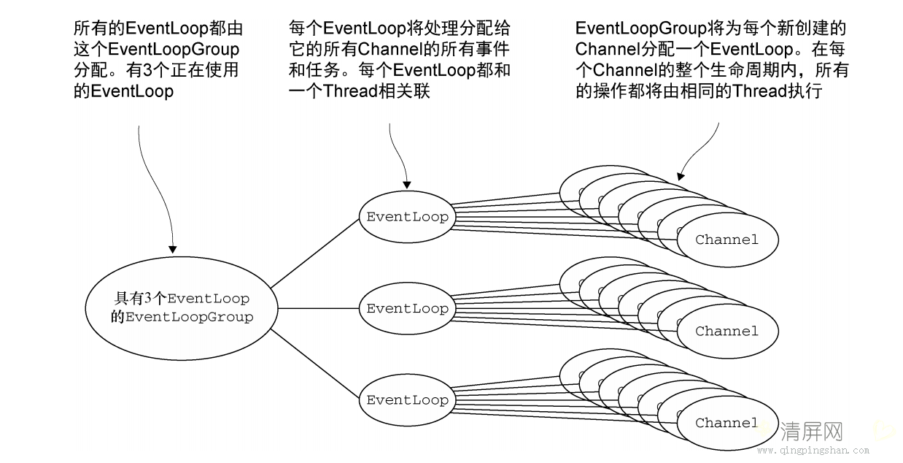
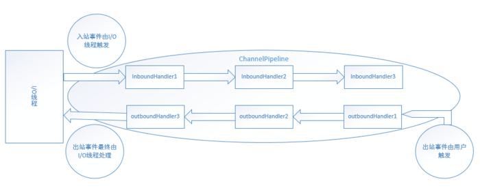
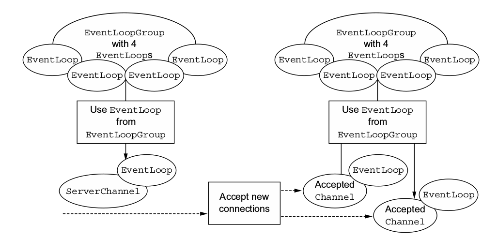

## netty高性能网络框架-Netty的组建和设计

> 在Netty框架中有三大关键组建 Channel EventLoop channelFuture ChannelHandler channelPipeline bootstrap

如果和网络中的相关概念相互对应将会是如下的结果：

- Channel —— Socket

- EventLoop —— 控制流、多线程处理、并发

- ChannelFuture —— 异步通知

### 一.Chanel接口

这个接口实现基本的io操作(bind()、connect()、read()、write())，映射传统javaSocket的编程过程，大大降低相关的直接使用socket的复杂程度。相关的实现类

- NioSocketChannel
- NioSocketServerChannel

### 二.EventLoop接口

这个接口相当于一个人容器，控制链接生命周期所发生的相关所有的事件。

Channel、EventLoop、Thread、EventLoopGroup之间的关系如下图：

### 三.ChannelFuure接口

在netty中处理I/O操作异步返回值的方法就是ChannelFutrue接口，这个接口的addListener方法可以注册一个ChannelFutureListener方法，方便在某个操作完成的时候得到通知

### 四.ChannelHandler接口

管理数据流和执行应用程序逻辑的重要组件，ChannelHandler充当了所有处理入站和出站相关应用的逻辑处理的容器

有两个非常常用的子接口

ChannelInBoundHandler和ChannelOutboundHandler分别代表出站和入站的相关处理逻辑

### 五.ChannelPipeline接口

chanelPpeline接口为ChannelHandler链提供了容器，并定义了用在该链上传播入站和出站时间流的api ，当channl被创建的时候将自动的分配到他专属的ChannelPipeline中被相关的channlhandle处理

ChnanelPipeline中流动的是事件（事件中可能附加数据）。Netty定义了两种事件类型：入站（inbound）事件和出站（outbound）事件。ChannelPipeline使用拦截过滤器模式使用户可以掌控ChannelHandler处理事件的流程。注意：事件在ChannelPipeline中不自动流动而需要调用ChannelHandlerContext中诸如fileXXX()或者read()类似的方法将事件从一个ChannelHandler传播到下一个ChannelHandler

> 特殊东西ChannelHandlerContext

Context指上下文关系，ChannelHandler的Context指的是ChannleHandler之间的关系以及ChannelHandler与ChannelPipeline之间的关系。ChannelPipeline中的事件传播主要依赖于ChannelHandlerContext实现，由于ChannelHandlerContext中有ChannelHandler之间的关系，所以能得到ChannelHandler的后继节点，从而将事件传播到下一个ChannelHandler

### 六.引导bootstrap

> 引导字如其意，就是进行相关链接处理的工具方法

类别|BootStrap|ServerBootStrap
---|---|---
网络中编程的作用|链接远程的主机和端口|绑定到一个本地端口
EventLoopGroup的数量|1|2

**注意**:这里服务端的LoopGroup需要两个，,默认有两个eventloop分别是bossGroup和 workGroup，其中boss用来监控tcp链接,worker用来处理io事件。

